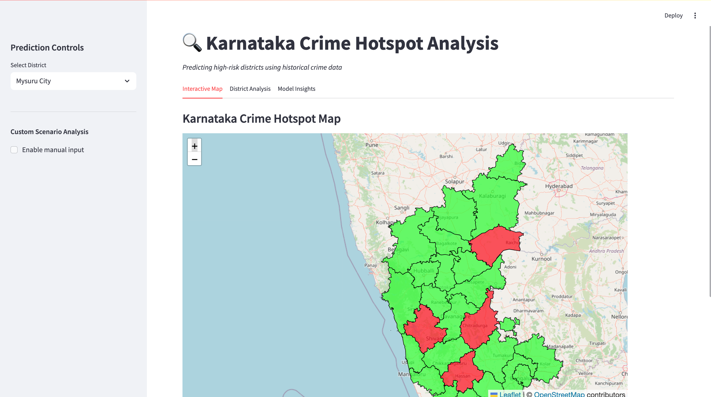
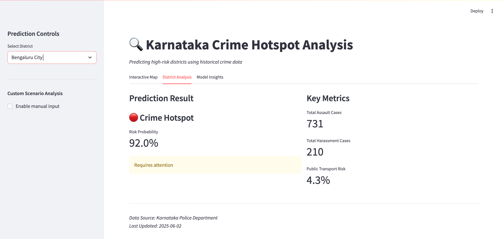
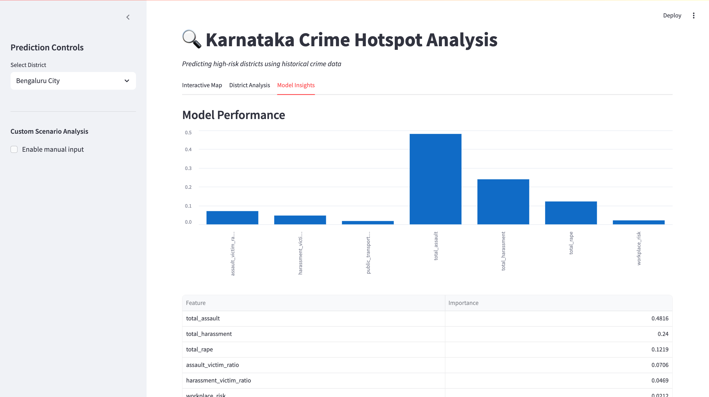

# Karnataka Crime Hotspot Prediction System

 
 
 

## 📌 Overview
A machine learning-powered dashboard that predicts and visualizes high-crime districts in Karnataka, India using historical crime data. The system combines:
- Random Forest classification
- Interactive geographical visualization
- Real-time scenario analysis

## ✨ Features
- **Interactive Karnataka Map**: Color-coded districts (red=hotspot, green=safe)
- **Prediction Engine**: 
  - Classifies districts as hotspots based on crime patterns
  - Provides risk probability scores
- **Custom Scenario Testing**: Modify crime inputs to simulate different situations
- **Model Explainability**: Shows feature importance and decision factors

Key interactions:

Select districts from dropdown

View hotspot predictions

Toggle manual input mode for scenario testing

Explore model insights

🤖 Model Details
Algorithm: Random Forest Classifier
Input Features:

Total assault cases

Sexual harassment incidents

Victim ratios

Location-based risk factors

Output: Binary classification (Hotspot/Safe) with probability score

📊 Data Sources
Karnataka Police Department crime records

DataMeet Karnataka GeoJSON

Census demographic data (optional en